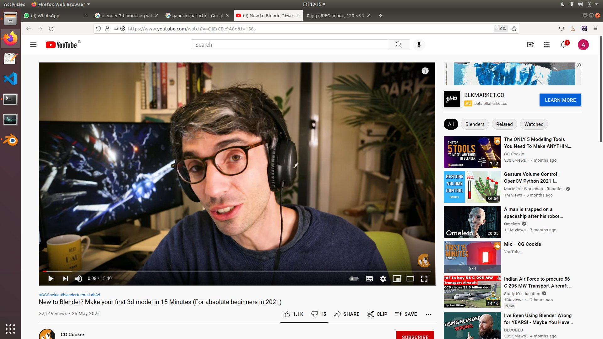
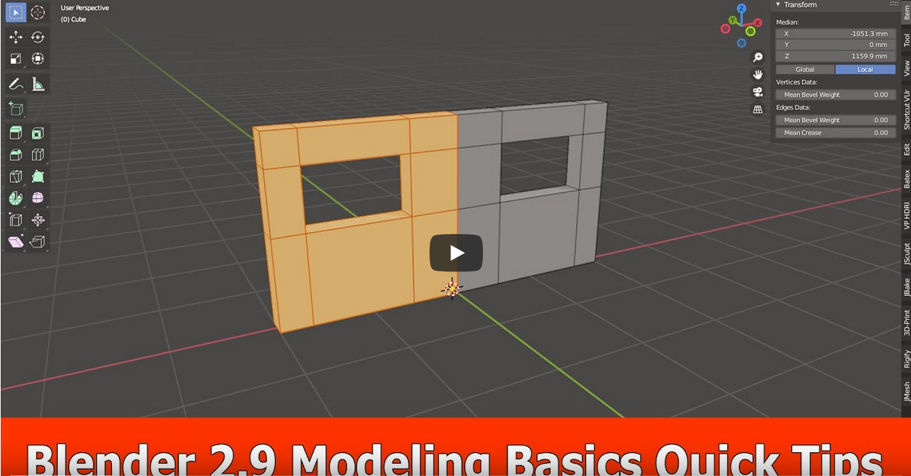
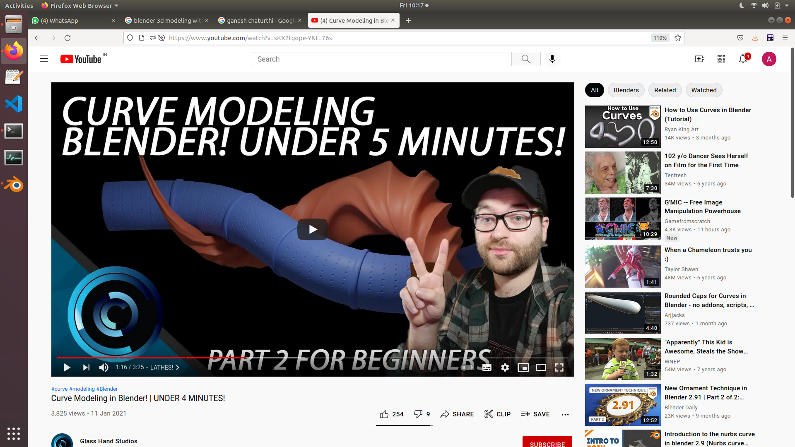
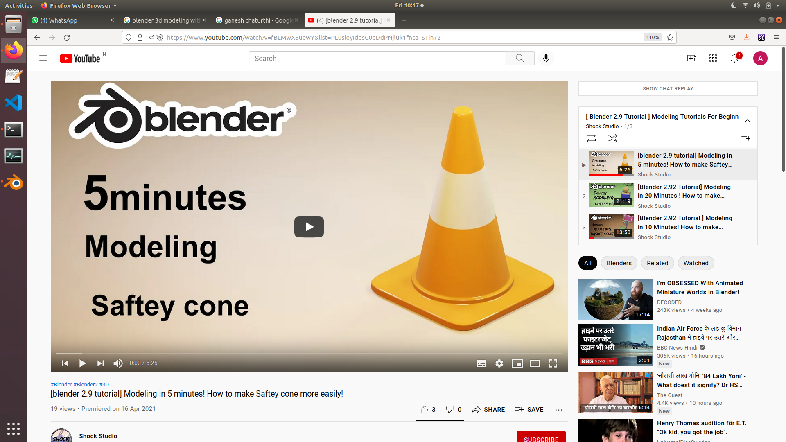

# Blender Complete Tutorial Series in 10 volumes for modeling and texturing

## tutorial 1 -----------------the blender interface in 5 minutes

## tutorial 2 -----------------make your first 3d model in 15 minutes

## tutorial 3 ----------------make a table in 10 minutes

## tutorial 4 ---------------make a pipe in 6 minutes 

## tutorial 5 --------------practice some more modeling techniques in 6 minutes

## tutorial 6 ------------- create a window and add textures to it in 10 minutes 

## tutorial 7 ------------ learn texture painting in 10 minutes 

## tutorial 8 ----------- blender materials for absolute beginner 

## tutorial 9 -----------realistic materials -PBR(physically based rendering) in 7 minutes 

## tutorial 10 ---------beginners guide to complex material in 15 minutes 

# Tutorial Series 2 ---   Practice more and more Modeling about 15 minutes daily

## tutorial 1 ------------ fundamentals in 11 minutes

## tutorial 2 ------------ quick tools 

## tutorial 3 ------------ spin tool  8 minutes

## tutorial 4 ------------ make a cup 

## tutorial 5 -----------  make a safety cone 7 minutes  

## tutorial 6------------ model a stair from scratch 

## tutorial 7 ---------   model a stair with custom pluggins 

## tutorial 8 ----------  artectural modeling in blender

## tutorial 9-----------  house plan in blender

## tutorial 10----------  make gears in blender

